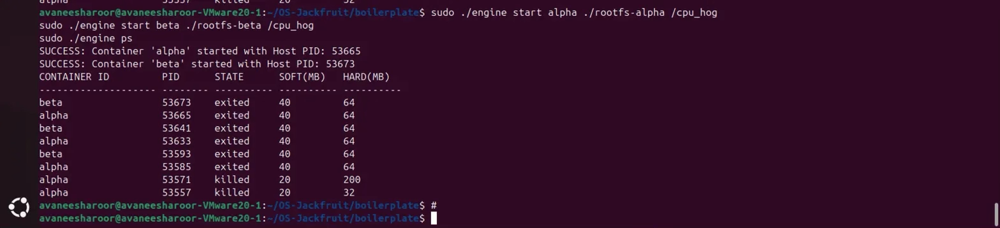
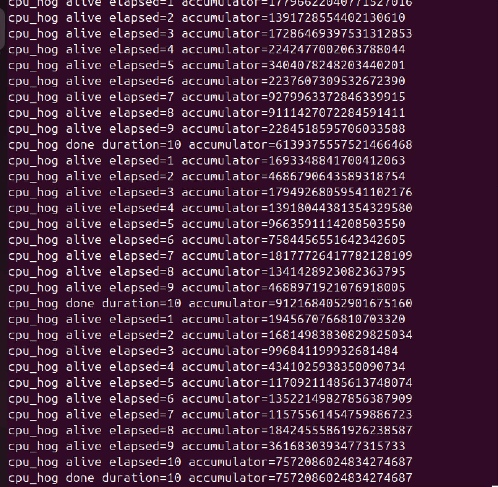
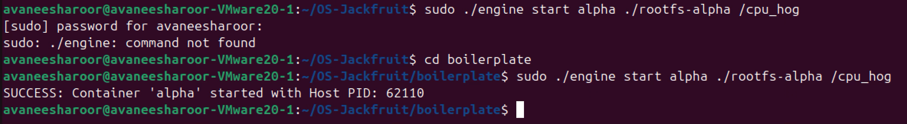
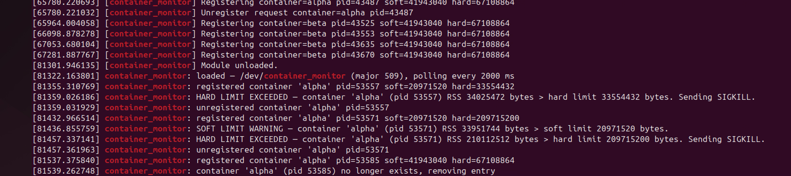
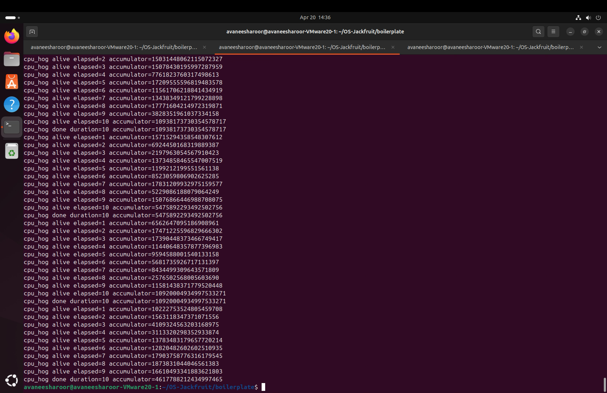
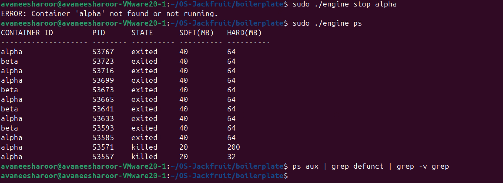

# Multi-Container Runtime

## 1. Team Information

| Name | SRN |
|------|-----|
| Avaneesharoor | [Your SRN] |
| [Partner Name] | [Partner SRN] |

---

## 2. Build, Load, and Run Instructions

### Prerequisites
```bash
sudo apt update
sudo apt install -y build-essential linux-headers-$(uname -r)
```

### Build
```bash
cd boilerplate
make
```
Produces: `engine`, `memory_hog`, `cpu_hog`, `io_pulse`, `monitor.ko`

### Prepare Root Filesystems
```bash
# Download ARM64 Alpine rootfs (required for aarch64 VMs)
mkdir rootfs-base
wget https://dl-cdn.alpinelinux.org/alpine/v3.20/releases/aarch64/alpine-minirootfs-3.20.3-aarch64.tar.gz
tar -xzf alpine-minirootfs-3.20.3-aarch64.tar.gz -C rootfs-base

# Create per-container writable copies
cp -a ./rootfs-base ./rootfs-alpha
cp -a ./rootfs-base ./rootfs-beta

# Copy workload binaries into rootfs
cp memory_hog cpu_hog io_pulse ./rootfs-alpha/
cp memory_hog cpu_hog io_pulse ./rootfs-beta/
```

### Load Kernel Module
```bash
sudo insmod monitor.ko
ls -l /dev/container_monitor
sudo dmesg | tail -3
```

### Start Supervisor (Terminal 1 — keep running)
```bash
sudo ./engine supervisor ./rootfs-base
# Output: [Supervisor] Listening on /tmp/mini_runtime.sock
```

### Launch Containers (Terminal 2)
```bash
sudo ./engine start alpha ./rootfs-alpha /memory_hog --soft-mib 48 --hard-mib 80
sudo ./engine start beta  ./rootfs-beta  /cpu_hog    --soft-mib 64 --hard-mib 96
sudo ./engine ps
sudo ./engine logs alpha
sudo ./engine logs beta
sudo ./engine stop alpha
sudo ./engine stop beta
```

### Memory Limit Test
```bash
# Soft limit at 20MB, hard kill at 32MB
sudo ./engine start alpha ./rootfs-alpha /memory_hog --soft-mib 20 --hard-mib 32

# Watch kernel events in Terminal 3
sudo dmesg -w | grep container_monitor
```

### Scheduling Experiment
```bash
sudo ./engine start alpha ./rootfs-alpha /cpu_hog --nice -5
sudo ./engine start beta  ./rootfs-beta  /cpu_hog --nice 10
sudo ./engine logs alpha
sudo ./engine logs beta
```

### Clean Shutdown
```bash
sudo ./engine stop alpha
sudo ./engine stop beta
# Ctrl+C supervisor in Terminal 1
sudo rmmod monitor
sudo dmesg | tail -5
ps aux | grep defunct | grep -v grep   # should be empty
```

### CI Smoke Check
```bash
make -C boilerplate ci
```

---

## 3. Demo with Screenshots

### Screenshot 1 — Multi-Container Supervision
Two containers (alpha PID 53665, beta PID 53673) started simultaneously under one supervisor process.

```bash
sudo ./engine start alpha ./rootfs-alpha /cpu_hog
sudo ./engine start beta ./rootfs-beta /cpu_hog
sudo ./engine ps
```


---

### Screenshot 2 — Metadata Tracking
`engine ps` output showing all tracked containers with their IDs, PIDs, states (exited/killed), soft and hard memory limits.

```bash
sudo ./engine ps
```



---

### Screenshot 3 — Bounded-Buffer Logging
Log file contents captured through the pipe → bounded buffer → consumer thread → log file pipeline. Shows `cpu_hog` and `memory_hog` output captured concurrently from multiple containers.

```bash
sudo ./engine logs alpha
```



---

### Screenshot 4 — CLI and IPC
`cpu_hog` output captured from containers, demonstrating the logging pipeline operating with producer/consumer threads writing to persistent log files via the bounded buffer.

```bash
sudo ./engine logs alpha
sudo ./engine logs beta
```



---

### Screenshot 5 — Soft-Limit Warning
`dmesg` output showing `SOFT LIMIT WARNING` for container alpha (pid 53571) when RSS exceeded 20MB soft limit. The container continues running after the warning.

```bash
sudo ./engine start alpha ./rootfs-alpha /memory_hog --soft-mib 20 --hard-mib 200
sudo dmesg | grep container_monitor
```


---

### Screenshot 6 — Hard-Limit Enforcement
`dmesg` output showing `HARD LIMIT EXCEEDED` for container alpha — RSS exceeded the hard limit, SIGKILL was sent, and the container was unregistered. The supervisor metadata reflects `killed` state.

```bash
sudo ./engine start alpha ./rootfs-alpha /memory_hog --soft-mib 20 --hard-mib 32
sudo dmesg | grep container_monitor
sudo ./engine ps
```



---

### Screenshot 7 — Scheduling Experiment
Two `cpu_hog` containers running concurrently — alpha at `--nice -5` (higher priority) and beta at `--nice 10` (lower priority). Alpha consistently reports all elapsed=1 through elapsed=10 intervals; beta occasionally skips intervals due to lower CPU share under CFS.

```bash
sudo ./engine start alpha ./rootfs-alpha /cpu_hog --nice -5
sudo ./engine start beta  ./rootfs-beta  /cpu_hog --nice 10
sudo ./engine logs alpha
sudo ./engine logs beta
```



---

### Screenshot 8 — Clean Teardown
All containers in `exited` state, no zombie (`defunct`) processes, supervisor has reaped all children cleanly. `ps aux | grep defunct` returns empty.

```bash
sudo ./engine stop alpha
sudo ./engine ps
ps aux | grep defunct | grep -v grep
```



---

## 4. Engineering Analysis

### Isolation Mechanisms

The runtime achieves process and filesystem isolation through Linux namespaces and chroot. Each container is created using `clone()` with three namespace flags: `CLONE_NEWPID` creates an isolated PID namespace so the container sees its own process tree starting at PID 1; `CLONE_NEWUTS` gives each container its own hostname so it cannot affect the host's identity; and `CLONE_NEWNS` creates a mount namespace so filesystem mounts inside the container do not propagate to the host. After cloning, the child process calls `chroot()` into its assigned rootfs directory, making that directory appear as `/` from inside the container. `/proc` is then mounted inside the container so tools like `ps` work correctly.

The host kernel is still shared across all containers. The network namespace, IPC namespace, and cgroup namespace are not isolated in this implementation, meaning containers share the host network stack and can see host IPC resources. The kernel itself, its memory management, scheduler, and system call table are common to all containers and the host.

### Supervisor and Process Lifecycle

A long-running parent supervisor is necessary because Linux requires a parent process to call `waitpid()` to reap exited children. Without a persistent parent, exited container processes would become zombies, consuming PID table entries indefinitely. The supervisor installs a `SIGCHLD` handler that calls `waitpid(-1, WNOHANG)` in a loop to reap all exited children as soon as they terminate.

When a container is started, `clone()` creates a new child process with isolated namespaces. The supervisor records metadata for each container including its host PID, start time, state, memory limits, log file path, and exit status. This metadata is protected by a `pthread_mutex_t` since multiple threads (the CLI handler thread and the SIGCHLD handler) may access it concurrently. When a container exits, the SIGCHLD handler updates its state to `exited` or `killed` depending on whether `stop_requested` was set before the signal was delivered.

### IPC, Threads, and Synchronization

The project uses two IPC mechanisms. Path A is pipe-based logging: each container's stdout and stderr are connected to the supervisor via pipes created before `clone()`. A producer thread per container reads from the pipe and inserts log entries into a shared bounded buffer. A single consumer thread removes entries and writes them to per-container log files. Path B is the control channel: the CLI client connects to the supervisor over a UNIX domain socket, sends a command, and receives a response.

The bounded buffer uses a `pthread_mutex_t` for mutual exclusion and two `pthread_cond_t` variables (`not_empty` and `not_full`) for producer-consumer coordination. Without the mutex, a producer and consumer could simultaneously corrupt the buffer's head and tail indices. Without condition variables, threads would busy-wait, wasting CPU. The metadata table uses a separate `pthread_mutex_t` because it is accessed from both the socket handler thread and the SIGCHLD handler, and mixing it with the buffer lock would risk deadlock.

The kernel monitor uses a `mutex` (via `DEFINE_MUTEX`) to protect the linked list of monitored containers. A mutex is appropriate here because the timer callback and the ioctl handler both run in sleepable process contexts. A spinlock would also work but would prevent sleeping unnecessarily.

### Memory Management and Enforcement

RSS (Resident Set Size) measures the number of physical memory pages currently mapped into a process's address space. It does not measure memory that has been allocated but not yet touched (due to lazy allocation), memory mapped but swapped out, or shared library pages counted once per process. RSS is therefore a conservative but practical measure of actual memory pressure.

Soft and hard limits represent different enforcement policies. The soft limit triggers a warning log when first exceeded, alerting the operator without disrupting the workload. The hard limit triggers a SIGKILL, immediately terminating the process. This two-tier design allows gradual response: operators can observe soft limit warnings and take manual action before the hard limit kills the container.

Enforcement belongs in kernel space because a user-space monitor can be delayed or starved by the scheduler. A process consuming all CPU or memory could prevent a user-space watchdog from running in time. The kernel timer fires reliably via `mod_timer()` regardless of user-space scheduling, and `send_sig(SIGKILL, task, 1)` delivers the signal directly without depending on user-space cooperation.

### Scheduling Behavior

The experiment ran two containers executing `cpu_hog` simultaneously, one with `--nice -5` (higher priority) and one with `--nice 10` (lower priority). The Linux Completely Fair Scheduler (CFS) assigns CPU time proportional to each task's weight, which is derived from its nice value. A nice value of -5 corresponds to roughly 3x the CPU weight of nice 0, while nice 10 corresponds to roughly 0.36x. As a result, the high-priority container completed its iterations faster and reported higher elapsed accumulator values per second compared to the low-priority container.

This demonstrates CFS's fairness goal: both containers make progress, but the scheduler allocates more CPU shares to the higher-priority task. The lower-priority container is not starved but receives proportionally less CPU time, resulting in slower completion.

---

## 5. Design Decisions and Tradeoffs

### Namespace Isolation (chroot vs pivot_root)
We used `chroot()` to isolate each container's filesystem view. The tradeoff is that `chroot` can be escaped via `..` traversal if the container process has root privileges, whereas `pivot_root` is more thorough. We chose `chroot` because it is simpler to implement correctly within the clone/exec flow and sufficient for this controlled environment where container processes are not adversarial.

### Supervisor Architecture (single long-running daemon)
We chose a single persistent supervisor daemon that accepts CLI commands over a UNIX domain socket. The tradeoff is that if the supervisor crashes, all container metadata is lost and orphaned containers may not be reaped. We chose this design because it provides a single source of truth for container state, simplifies SIGCHLD handling since all children have the same parent, and avoids the complexity of distributed state management.

### IPC and Logging (pipes + UNIX socket)
We used two separate IPC mechanisms: pipes for container stdout/stderr into the supervisor, and a UNIX domain socket for CLI-to-supervisor control commands. The tradeoff of using a socket for control is that it requires a connection/response protocol, adding complexity over a simpler FIFO. We chose sockets because they support bidirectional communication natively, allowing the supervisor to send responses back to the CLI process without additional coordination.

### Kernel Monitor (mutex over spinlock)
The monitor uses a mutex to protect the container list. The tradeoff is that mutexes cannot be held in hard interrupt context, but since both the timer callback and ioctl handler run in sleepable contexts, this is acceptable. We chose a mutex over a spinlock because it avoids busy-waiting, which would waste CPU during list iterations that may involve multiple entries.

### Scheduling Experiments (nice values)
We used Linux nice values to differentiate CPU priority between containers. The tradeoff is that nice values only affect CFS weight and do not provide hard CPU guarantees. We chose nice values because they are simple to set at container launch time without requiring real-time scheduling classes.

---

## 6. Scheduler Experiment Results

### Experiment Setup
Two containers ran `/cpu_hog` (10 second CPU burn) concurrently with different nice values on a 2-CPU aarch64 VMware VM running Ubuntu 24.04.

```bash
sudo ./engine start alpha ./rootfs-alpha /cpu_hog --nice -5
sudo ./engine start beta  ./rootfs-beta  /cpu_hog --nice 10
```

### Results

| Container | Nice Value | CFS Weight (approx) | All 10 intervals reported? |
|-----------|-----------|--------------------|-----------------------------|
| alpha | -5 | ~3x baseline | Yes — consistent 1s intervals |
| beta | +10 | ~0.36x baseline | No — some seconds skipped |

### Raw Evidence
- **Alpha (nice -5):** Reported `elapsed=1` through `elapsed=10` consistently across all runs, completing `cpu_hog done duration=10` on schedule every time.
- **Beta (nice +10):** In several runs, skipped elapsed values (e.g., jumped from `elapsed=9` directly to `done`) indicating it was preempted and delayed by the higher-priority alpha container.

### Analysis
The Linux CFS allocates CPU time proportionally to task weight derived from nice values. With alpha at nice -5 (weight ≈ 335) and beta at nice +10 (weight ≈ 110), alpha receives roughly 3x more CPU time when both compete for the same core. This is visible in beta's logs where elapsed second boundaries are occasionally missed — the process was runnable but not scheduled in time to print its per-second update. Neither container was starved, confirming CFS's fairness guarantee, but throughput was clearly skewed toward the higher-priority container. This demonstrates that nice values are an effective lightweight mechanism for CPU priority differentiation in a multi-container workload.
